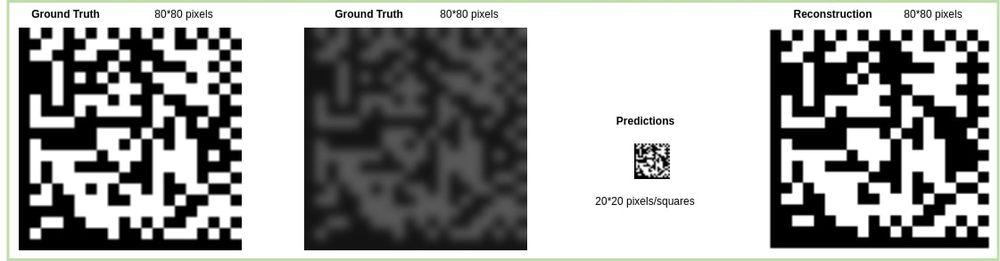
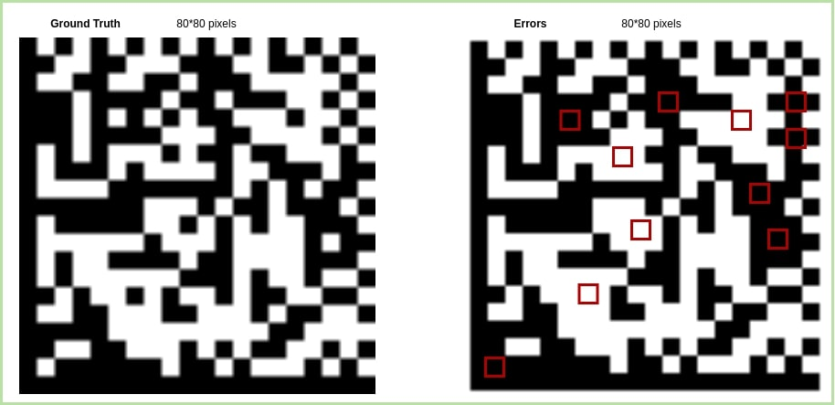
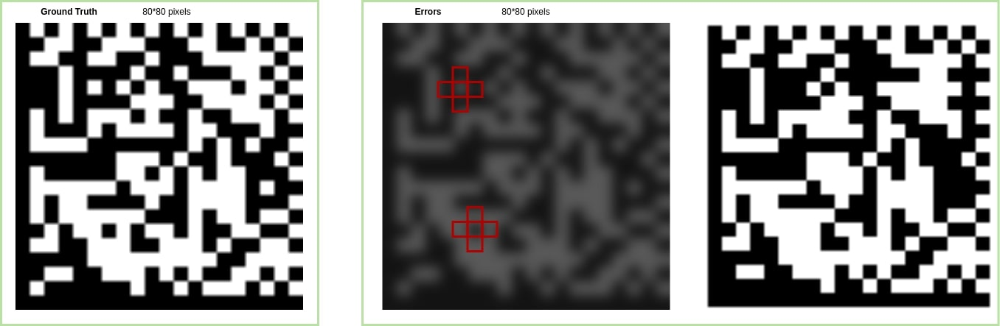
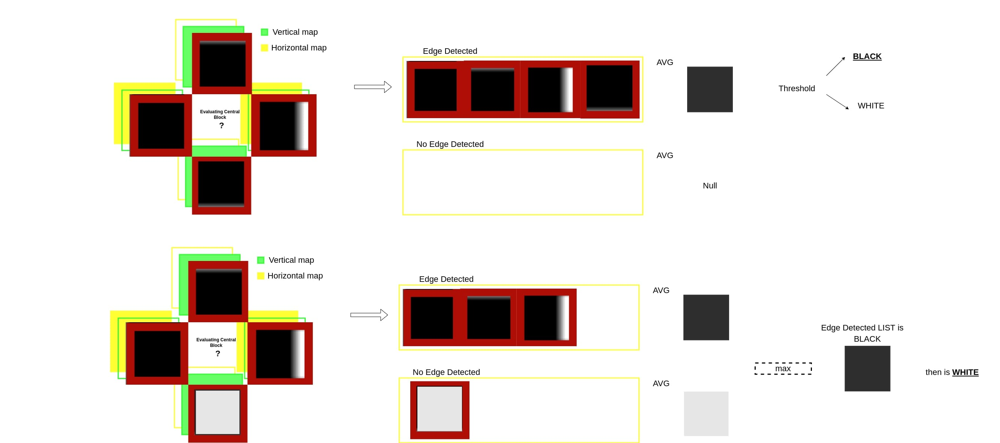

# CNN-Datamatrix-Reconstruction
Scanning Datamatrix in low resolution images is not a easy task since artifacts,blurring and illuminance effect can effect images collected by a camera sensor in real scenarios enviroment, here is providen a model that taking in input a extracted unreadable datamatrix image generates prediction for it with high chance to be readable. [Data Extraction Method for Industrial Data Matrix Codes Based
on Local Adjacent Modules Structure](https://www.mdpi.com/2076-3417/12/5/2291)

  
Setup

  
  ## Requirement
  ## Install 

  
Synthetic data

  

  ## Datamatrix generation
  ## Augmentation

Training & Testing

  ## Training
  ## Testing
  ## Inference and Usage

Related

  ## DataMatrix Detection
  ## Extraction and refining

